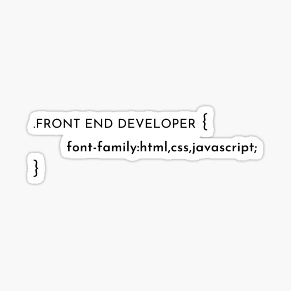

<!-- Profile Header -->

  

<!-- Main Section -->
<h1 align="center">
  
  
  
</h1>

<h1 align="center"> I'm Monik </h1>
<h3 align="center">An aspiring passionate frontend developer from India</h3>

<!-- Header Image -->

  

<!-- Typing SVG Section -->

  

<!-- About Me Section -->
- 🌱 I’m currently learning **React**

- 📫 How to reach me: [LinkedIn](https://www.linkedin.com/in/monikanchan-chatterjee-a86862200)

- ⚡ Fun fact: I love exploring new themes in VS Code

<!-- Connect with Me Section -->
<h3 align="left">Connect with me:</h3>

  

<!-- GitHub Stats Section -->

  

  

  

<!-- Additional Section (if needed) -->

  

<!-- Footer Section -->

  

  

## Inspiration

- **[italopolazzi](http://github.com/italopolazzi)**
- **[dlemstra](https://github.com/dlemstra/dlemstra)**
